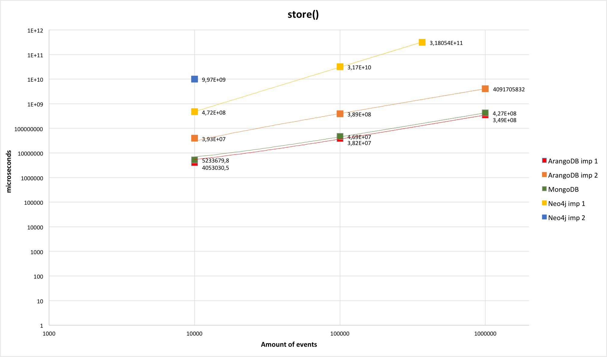

# eiffel-persistence-technology-evaluation
Repository for evaluation of database technologies for the purposes of storing and retrieving Eiffel events.

## Tests

### Implementations

1. MongoDB - DBMS that supports document model
2. Neo4j  - DBMS that supports graph model
   - Imp1 - Each event is one node. Information from JSON object is adapted so that each key-value pair is a node property
   - Imp2 - Each level of the JSON object is stored separately as a node. One event is divided into multiple nodes
3. ArangoDB - DBMS that supports key, document and graph models
   - Imp1 - Pure document implementation, same as MongoDB
   - Imp2 - Multi-model implementation, combination of document and graph models
   
### Tests' description

- Each test case is executed 10 times to get the average execution time.
- Execution time is measured in microseconds.
- Tests are performed on different amounts of events: 10 000, 100 000, 1000 000

1.  store()

2.  getEvent()

3.  getEvents()	:
```
	 3_0	:	param	:	meta.time !=; skip = 0; limit = 5000
```
```
	 3_1	:	param	: 	meta.type = ; limit 1000; skip = 0
	 3_2	:	param	:	meta.type =; meta.version =  ; limit 1000; skip = 0
	 3_3	:	param	: 	meta.type =; meta.version =  ; data.name=; limit 1000; skip = 0
	 3_4	:	param	: 	meta.type = "EiffelConfidenceLevelModifiedEvent"; meta.version =  ; data.version =; data.name =; limit 1000; skip = 0
	 3_5	:	param	: 	meta.type = "EiffelConfidenceLevelModifiedEvent"; meta.version =  ; meta.time =; data.name =; data.version =; limit = 1000; skip = 0
```
```
	 3_6	:	param	: 	meta.time != ; limit 10; skip = 0
	 3_7	:	param	: 	meta.time != ; limit 100; skip = 0
	 3_8	:	param	: 	meta.time != ; limit 1000; skip = 0
	 3_9	:	param	: 	meta.time != ; limit 10000; skip = 0
	 3_10	:	param	: 	meta.time != ; limit 100000; skip = 0

	 3_11	:	param	: 	meta.time != ; limit 10000; skip = 1
	 3_12	:	param	: 	meta.time != ; limit 10000;; skip = 5
	 3_13	:	param	: 	meta.time != ; limit 10000; skip = 10
	 3_14	:	param	: 	meta.time != ; limit 10000; skip = 20
	 3_15	:	param	: 	meta.time != ; limit 10000; skip = 50
```
```
	 3_16	:	param	: 	meta.time = ; limit 1000; skip = 0
	 3_17	:	param	: 	meta.time > ; limit 1000; skip = 0
	 3_18	:	param	: 	meta.time < ; limit 1000; skip = 0
	 3_19	:	param	: 	meta.time >= ; limit 1000; skip = 0
	 3_20	:	param	: 	meta.time <= ; limit 1000; skip = 0
	 3_21	:	param	: 	meta.time != ; limit 1000; skip = 0
	 3_22	:	param	: 	meta.time > ; meta.time <; limit 1000; skip = 0
```

4.  getArtifactsByGroup()	:
```
	 4_0	:	param	:	gav.groupid = ; skip = 0; limit = 1
```
```
	 4_1	:	param	: 	gav.groupid = ; limit 1000; skip = 0
	 4_2	:	param	:	gav.groupid = ; meta.type = ; limit 1000; skip = 0
	 4_3	:	param	: 	gav.groupid = ; meta.type =; meta.version =  ; limit 1000; skip = 0
	 4_4	:	param	: 	gav.groupid = ; meta.type =; meta.version =  ; meta.time =; limit 1000; skip = 0
```
```
	 4_5	:	param	: 	gav.groupid = ; limit 10; skip = 0
	 4_6	:	param	: 	gav.groupid =  ; limit 100; skip = 0
	 4_7	:	param	: 	gav.groupid =  ; limit 1000; skip = 0
	 4_8	:	param	: 	gav.groupid = ; limit 10000; skip = 0
	 4_9	:	param	: 	gav.groupid = ; limit 100000; skip = 0
```
```
	 4_10	:	param	: 	gav.groupid = ; limit 100000; skip = 1
	 4_11	:	param	: 	gav.groupid =  ; limit 100000;; skip = 5
	 4_12	:	param	: 	gav.groupid =  ; limit 100000; skip = 10
	 4_13	:	param	: 	gav.groupid = ; limit 100000; skip = 20
	 4_14	:	param	: 	gav.groupid = ; limit 100000; skip = 50
```

5.  getArtifactsByGroupAndArtifactId()	:
```
	 5_0	:	param	:	gav.groupid = ; gav.artifactId() = ; skip = 0; limit = 5000
```
```
	 5_1	:	param	: 	gav.groupid = ; gav.artifactId() = ; limit 1000; skip = 0
	 5_2	:	param	:	gav.groupid = ; gav.artifactId() = ; meta.type = ; limit 1000; skip = 0
	 5_3	:	param	: 	gav.groupid = ; gav.artifactId() = ; meta.type =; meta.version =  ; limit 1000; skip = 0
	 5_4	:	param	: 	gav.groupid = ; gav.artifactId() = ; meta.type =; meta.version =  ; meta.time =; limit 1000; skip = 0
```
```
	 5_5	:	param	: 	gav.groupid = ; gav.artifactId() = ; limit 10; skip = 0
	 5_6	:	param	: 	gav.groupid = ; gav.artifactId() = ; limit 100; skip = 0
	 5_7	:	param	: 	gav.groupid = ; gav.artifactId() = ; limit 1000; skip = 0
	 5_8	:	param	: 	gav.groupid = ; gav.artifactId() = ; limit 10000; skip = 0
	 5_9	:	param	: 	gav.groupid = ; gav.artifactId() = ; limit 100000; skip = 0
```
```
	 5_10	:	param	: 	gav.groupid = ; gav.artifactId() = ; limit 100000; skip = 1
	 5_11	:	param	: 	gav.groupid = ; gav.artifactId() = ; limit 100000;; skip = 5
	 5_12	:	param	: 	gav.groupid = ; gav.artifactId() = ; limit 100000; skip = 10
	 5_13	:	param	: 	gav.groupid = ; gav.artifactId() = ; limit 100000; skip = 20
	 5_14	:	param	: 	gav.groupid = ; gav.artifactId() = ; limit 100000; skip = 50
```

6.  getArtifactByGAV()	:
```
	 6_1	:	param	: 	gav.groupid = ; gav.artifactId() = ; gav.version = ;
	 6_2	:	param	:	gav.groupid = ; gav.artifactId() = ; gav.version = ;
	 6_3	:	param	: 	gav.groupid = ; gav.artifactId() = ; gav.version = ;
	 6_4	:	param	: 	gav.groupid = ; gav.artifactId() = ; gav.version = ;
	 6_5	:	param	: 	gav.groupid = ; gav.artifactId() = ; gav.version = ;
	 6_6	:	param	: 	gav.groupid = ; gav.artifactId() = ; gav.version = ;
	 6_7	:	param	: 	gav.groupid = ; gav.artifactId() = ; gav.version = ;
	 6_8	:	param	: 	gav.groupid = ; gav.artifactId() = ; gav.version = ;
```

7.  getUpstreamEvents()		:
```
	 7_0	:	param	:	meta.id =; linkTypes : "ALL" ; levels = 50; limit = 5000
```
```
	 7_1	:	param	: 	meta.id =; linkTypes : CAUSE ; limit = 1000; levels = 10;
	 7_2	:	param	:	meta.id =; linkTypes : CAUSE, ELEMENT ; limit = 1000; levels = 10;
	 7_3	:	param	: 	meta.id =; linkTypes : CAUSE, ELEMENT, CONTEXT ; limit = 1000; levels = 10;
	 7_4	:	param	: 	meta.id =; linkTypes : CAUSE, ELEMENT, CONTEXT, COMPOSITION; limit = 1000; levels = 10;
	 7_5	:	param	: 	meta.id =; linkTypes : CAUSE, ELEMENT, CONTEXT, COMPOSITION, BASE; limit = 1000; levels = 10;
```
```
	 7_6	:	param	: 	meta.id =; linkTypes : "ALL" ; limit = 1000; levels = 1;
	 7_7	:	param	: 	meta.id =; linkTypes : "ALL" ; limit = 1000; levels = 5;
	 7_8	:	param	: 	meta.id =; linkTypes : "ALL" ; limit = 1000; levels = 10;
	 7_9	:	param	: 	meta.id =; linkTypes : "ALL" ; limit = 1000; levels = 25;
```
```
	 7_10	:	param	: 	meta.id =; linkTypes : "ALL" ; limit = 10; levels = 10;
	 7_11	:	param	: 	meta.id =; linkTypes : "ALL" ; limit = 20; levels = 10;
	 7_12	:	param	: 	meta.id =; linkTypes : "ALL" ; limit = 40; levels = 10;
	 7_13	:	param	: 	meta.id =; linkTypes : "ALL" ; limit = 80; levels = 10;
	 7_14	:	param	: 	meta.id =; linkTypes : "ALL" ; limit = 160; levels = 10;
```

8.  getDownstreamEvents()	:
```
	 8_0	:	param	:	meta.id =; linkTypes : "ALL" ; levels = 50; limit = 5000
```
```
	 8_1	:	param	: 	meta.id =; linkTypes : CAUSE ; limit = 1000; levels = 10;
	 8_2	:	param	:	meta.id =; linkTypes : CAUSE, ELEMENT ; limit = 1000; levels = 10;
	 8_3	:	param	: 	meta.id =; linkTypes : CAUSE, ELEMENT, CONTEXT ; limit = 1000; levels = 10;
	 8_4	:	param	: 	meta.id =; linkTypes : CAUSE, ELEMENT, CONTEXT, COMPOSITION; limit = 1000; levels = 10;
	 8_5	:	param	: 	meta.id =; linkTypes : CAUSE, ELEMENT, CONTEXT, COMPOSITION, BASE; limit = 1000; levels = 10;
```
```
	 8_6	:	param	: 	meta.id =; linkTypes : "ALL" ; limit = 1000; levels = 1;
	 8_7	:	param	: 	meta.id =; linkTypes : "ALL" ; limit = 1000; levels = 5;
	 8_8	:	param	: 	meta.id =; linkTypes : "ALL" ; limit = 1000; levels = 10;
	 8_9	:	param	: 	meta.id =; linkTypes : "ALL" ; limit = 1000; levels = 25;
```
```
	 8_10	:	param	: 	meta.id =; linkTypes : "ALL" ; limit = 10; levels = 10;
	 8_11	:	param	: 	meta.id =; linkTypes : "ALL" ; limit = 20; levels = 10;
	 8_12	:	param	: 	meta.id =; linkTypes : "ALL" ; limit = 40; levels = 10;
	 8_13	:	param	: 	meta.id =; linkTypes : "ALL" ; limit = 80; levels = 10;
	 8_14  	:	param	: 	meta.id =; linkTypes : "ALL" ; limit = 160; levels = 10;
```

9.  Combinations	:
- getEvent() + getUpstreamEvents() :
```
	 9_1_1	:	param	: 	meta.id =; linkTypes : CAUSE ; limit = 1000; levels = 10;
	 9_1_2	:	param	:	meta.id =; linkTypes : CAUSE, ELEMENT ; limit = 1000; levels = 10;
	 9_1_3	:	param	: 	meta.id =; linkTypes : CAUSE, ELEMENT, CONTEXT ; limit = 1000; levels = 10;
	 9_1_4	:	param	: 	meta.id =; linkTypes : CAUSE, ELEMENT, CONTEXT, COMPOSITION; limit = 1000; levels = 10;
	 9_1_5	:	param	: 	meta.id =; linkTypes : CAUSE, ELEMENT, CONTEXT, COMPOSITION, BASE; limit = 1000; levels = 10;
```
```
	 9_1_6	:	param	: 	meta.id =; linkTypes : "ALL" ; limit = 1000; levels = 1;
	 9_1_7	:	param	: 	meta.id =; linkTypes : "ALL" ; limit = 1000; levels = 5;
	 9_1_8	:	param	: 	meta.id =; linkTypes : "ALL" ; limit = 1000; levels = 10;
	 9_1_9	:	param	: 	meta.id =; linkTypes : "ALL" ; limit = 1000; levels = 25;
	 9_1_10	:	param	: 	meta.id =; linkTypes : "ALL" ; limit = 1000; levels = 50;
```
```
	 9_1_11	:	param	: 	meta.id =; linkTypes : "ALL" ; limit = 10; levels = 10;
	 9_1_12	:	param	: 	meta.id =; linkTypes : "ALL" ; limit = 20; levels = 10;
	 9_1_13	:	param	: 	meta.id =; linkTypes : "ALL" ; limit = 40; levels = 10;
	 9_1_14	:	param	: 	meta.id =; linkTypes : "ALL" ; limit = 80; levels = 10;
	 9_1_15	:	param	: 	meta.id =; linkTypes : "ALL" ; limit = 160; levels = 10;
```

- getEvent()  + getDownstreamEvents() :
	
```
	 9_2_1	:	param	: 	meta.id =; linkTypes : CAUSE ; limit = 1000; levels = 10;
	 9_2_2	:	param	:	meta.id =; linkTypes : CAUSE, ELEMENT ; limit = 1000; levels = 10;
	 9_2_3	:	param	: 	meta.id =; linkTypes : CAUSE, ELEMENT, CONTEXT ; limit = 1000; levels = 10;
	 9_2_4	:	param	: 	meta.id =; linkTypes : CAUSE, ELEMENT, CONTEXT, COMPOSITION; limit = 1000; levels = 10;
	 9_2_5	:	param	: 	meta.id =; linkTypes : CAUSE, ELEMENT, CONTEXT, COMPOSITION, BASE; limit = 1000; levels = 10;
```
```
	 9_2_6	:	param	: 	meta.id =; linkTypes : "ALL" ; limit = 1000; levels = 1;
	 9_2_7	:	param	: 	meta.id =; linkTypes : "ALL" ; limit = 1000; levels = 5;
	 9_2_8	:	param	: 	meta.id =; linkTypes : "ALL" ; limit = 1000; levels = 10;
	 9_2_9	:	param	: 	meta.id =; linkTypes : "ALL" ; limit = 1000; levels = 25;
	 9_2_10	:	param	: 	meta.id =; linkTypes : "ALL" ; limit = 1000; levels = 50;
```
```
	 9_2_11	:	param	: 	meta.id =; linkTypes : "ALL" ; limit = 10; levels = 10;
	 9_2_12	:	param	: 	meta.id =; linkTypes : "ALL" ; limit = 20; levels = 10;
	 9_2_13	:	param	: 	meta.id =; linkTypes : "ALL" ; limit = 40; levels = 10;
	 9_2_14	:	param	: 	meta.id =; linkTypes : "ALL" ; limit = 80; levels = 10;
	 9_2_15	:	param	: 	meta.id =; linkTypes : "ALL" ; limit = 160; levels = 10;
```

- getArtifactsByGroup() + getUpstreamEvents() :
	
```
	 9_3_1	:	param	: 	gav.groupid = ; linkTypes : CAUSE ; limit = 1000; levels = 10;
	 9_3_2	:	param	:	gav.groupid = ; linkTypes : CAUSE, ELEMENT ; limit = 1000; levels = 10;
	 9_3_3	:	param	: 	gav.groupid = ; linkTypes : CAUSE, ELEMENT, CONTEXT ; limit = 1000; levels = 10;
	 9_3_4	:	param	: 	gav.groupid = ;  linkTypes : CAUSE, ELEMENT, CONTEXT, COMPOSITION; limit = 1000; levels = 10;
	 9_3_5	:	param	: 	gav.groupid = ;  linkTypes : CAUSE, ELEMENT, CONTEXT, COMPOSITION, BASE; limit = 1000; levels = 10;
```

- getArtifactsByGroup() + getDownstreamEvents() :
	
```
	 9_4_1	:	param	: 	gav.groupid = ; linkTypes : CAUSE ; limit = 1000; levels = 10;
	 9_4_2	:	param	:	gav.groupid = ; linkTypes : CAUSE, ELEMENT ; limit = 1000; levels = 10;
	 9_4_3	:	param	: 	gav.groupid = ; linkTypes : CAUSE, ELEMENT, CONTEXT ; limit = 1000; levels = 10;
	 9_4_4	:	param	: 	gav.groupid = ;  linkTypes : CAUSE, ELEMENT, CONTEXT, COMPOSITION; limit = 1000; levels = 10;
	 9_4_5	:	param	: 	gav.groupid = ;  linkTypes : CAUSE, ELEMENT, CONTEXT, COMPOSITION, BASE; limit = 1000; levels = 10;
```

- getArtifactByGAV() + getUpstreamEvents() :
	
```
	 9_5_1	:	param	: 	gav.groupid = ; gav.artifactId() = ; gav.version = ; linkTypes : CAUSE ; limit = 1000; levels = 10;
	 9_5_2	:	param	: 	gav.groupid = ; gav.artifactId() = ; gav.version = ; linkTypes : CAUSE, ELEMENT ; limit = 1000; levels = 10;
	 9_5_3	:	param	: 	gav.groupid = ; gav.artifactId() = ; gav.version = ; linkTypes : CAUSE, ELEMENT, CONTEXT ; limit = 1000; levels = 10;
	 9_5_4	:	param	: 	gav.groupid = ; gav.artifactId() = ; gav.version = ; linkTypes : CAUSE, ELEMENT, CONTEXT, COMPOSITION; limit = 1000; levels = 10;
	 9_5_5	:	param	: 	gav.groupid = ; gav.artifactId() = ; gav.version = ; linkTypes : CAUSE, ELEMENT, CONTEXT, COMPOSITION, BASE; limit = 1000; levels = 10;
```

- getArtifactByGAV() + getDownstreamEvents() :
	
```	
	 9_6_1	:	param	: 	gav.groupid = ; gav.artifactId() = ; gav.version = ; linkTypes : CAUSE ; limit = 1000; levels = 10;
	 9_6_2	:	param	: 	gav.groupid = ; gav.artifactId() = ; gav.version = ; linkTypes : CAUSE, ELEMENT ; limit = 1000; levels = 10;
	 9_6_3	:	param	: 	gav.groupid = ; gav.artifactId() = ; gav.version = ; linkTypes : CAUSE, ELEMENT, CONTEXT ; limit = 1000; levels = 10;
	 9_6_4	:	param	: 	gav.groupid = ; gav.artifactId() = ; gav.version = ; linkTypes : CAUSE, ELEMENT, CONTEXT, COMPOSITION; limit = 1000; levels = 10;
	 9_6_5	:	param	: 	gav.groupid = ; gav.artifactId() = ; gav.version = ; linkTypes : CAUSE, ELEMENT, CONTEXT, COMPOSITION, BASE; limit = 1000; levels = 10;
```

10. Different amount of threads	:
- 1 - 7 Threads :
```
	 10_1	:	3_16
	 10_2	:	3_16, 3_17
	 10_3	:	3_16, 3_17, 3_18
	 10_4	:	3_16, 3_17, 3_18, 3_19
	 10_5	:	3_16, 3_17, 3_18, 3_19, 3_20
	 10_6	:	3_16, 3_17, 3_18, 3_19, 3_20,3_21
	 10_7	:	3_16, 3_17, 3_18, 3_19, 3_20,3_21, 3_22
```

- 1-10 Threads :
	
```
	 10_8	:	7_1
	 10_9	:	7_1, 7_2
	 10_10	:	7_1, 7_2, 7_3
	 10_11	:	7_1, 7_2, 7_3, 7_4
	 10_12	:	7_1, 7_2, 7_3, 7_4, 7_5
	 10_13	:	7_1, 7_2, 7_3, 7_4, 7_5, 8_1
	 10_14	:	7_1, 7_2, 7_3, 7_4, 7_5, 8_1, 8_2
	 10_15	:	7_1, 7_2, 7_3, 7_4, 7_5, 8_1, 8_2, 8_3
	 10_16	:	7_1, 7_2, 7_3, 7_4, 7_5, 8_1, 8_2, 8_3, 8_4
	 10_17	:	7_1, 7_2, 7_3, 7_4, 7_5, 8_1, 8_2, 8_3, 8_4, 8_5
```	 

## Results

Some of the more important results.
* All results are in microseconds
* All tests are done without using indexing

1.  store()

- Average :

| DBMS  | 10 000 | 100 000 | 1000 000 |
| ------------- | ------------- | ------------- | ------------- |
| MongoDB  | 5.23E+06 | 4.69E+07 | 4.27E+08 |
| Neo4j Imp1  | 4.72E+08 | 3.17E+10 | * |
| Neo4j Imp2  | 9.97E+09 | - | - |
| ArangoDB Imp1  | 4.05E+06 | 3.82E+07 | 3.49E+08 |
| ArangoDB Imp2  | 3.93E+07 | 3.89E+08 | 4.09E+09 |

* Storing of 367 994 events took 88 hours 20 minutes 54 seconds



- - - -

2.  getEvent()

- Average :

| DBMS  | 10 000 | 100 000 | 1000 000 |
| ------------- | ------------- | ------------- | ------------- |
| MongoDB  | 4170 | 4680.9 | 6247.1 |
| Neo4j Imp1  | 56830.7 | 309152.8 | - |
| Neo4j Imp2  | 313173.7 | - | - |
| ArangoDB Imp1  | 13408.1 | 84845.2 | 818298 |
| ArangoDB Imp2  | 13483.1 | 81983.8 | 811778.5 |

- - - -

3.  getEvents()	: 3_0

- Average :

| DBMS  | 10 000 | 100 000 | 1000 000 |
| ------------- | ------------- | ------------- | ------------- |
| MongoDB  | 1.13E+05 | 6.76E+05 | 4.17E+06 |
| Neo4j Imp1  | 2.00E+07 | 1.39E+08 | - |
| Neo4j Imp2  | 2.37E+09 | - | - |
| ArangoDB Imp1  | 8.49E+04 | 5.96e+05 | 6.28E+06 |
| ArangoDB Imp2  | 8.38E+04 | 5.64E+05 | 6.35E+06 |

- Average per event :

| DBMS  | 10 000 | 100 000 | 1000 000 |
| ------------- | ------------- | ------------- | ------------- |
| MongoDB  | 113.3 | 676.0 | 4174.6 |
| Neo4j Imp1  | 19992.4 | 138617.5 | - |
| Neo4j Imp2  | 2.37E+06 | - | - |
| ArangoDB Imp1  | 84.9 | 596.0 | 6278.7 |
| ArangoDB Imp2  | 83.8 | 564.5 | 6352.2 |

- - - -

3.  getEvents()	: 3_10

- Average :

| DBMS  | 10 000 | 100 000 | 1000 000 |
| ------------- | ------------- | ------------- | ------------- |
| MongoDB  | 3.27E+05 | * | * |
| Neo4j Imp1  | 2.08E+08 | 1.33E+10 | - |
| Neo4j Imp2  | 2.37E+09 | - | - |
| ArangoDB Imp1  | 3.07E+05 | 4.17E+06 | 1.06E+07 |
| ArangoDB Imp2  | 3.25E+05 | 4.68E+06 | 1.09E+07 |

- Average per event :

| DBMS  | 10 000 | 100 000 | 1000 000 |
| ------------- | ------------- | ------------- | ------------- |
| MongoDB  | 32.7 | * | * |
| Neo4j Imp1  | 20849.1 | 133290.5 | - |
| Neo4j Imp2  | 237184.7 | - | - |
| ArangoDB Imp1  | 30.7 | 41.7 | 105.6 |
| ArangoDB Imp2  | 32.5 | 46.8 | 109.1 |

* MongoDB could not perform this test for 100 000 and 1000 000 events, because its built-in sort function has a max size limitation.

- - - -

7.  getUpstreamEvents()	: 7_0

- Average :

| DBMS  | 10 000 | 100 000 | 1000 000 |
| ------------- | ------------- | ------------- | ------------- |
| MongoDB  | 4.73E+08 | 4.30E+09 | 4.17E+10 |
| Neo4j Imp1  | 7.47E+06 | 1.44E+07 | - |
| Neo4j Imp2  | - | - | - |
| ArangoDB Imp1  | 1.21E+09 | 1.19E+10 | - |
| ArangoDB Imp2  | 1.37E+07 | 1.48E+07 | 1.65E+07 |

- Average per event :

| DBMS  | 10 000 | 100 000 | 1000 000 |
| ------------- | ------------- | ------------- | ------------- |
| MongoDB  | 7.88E+06 | 7.16E+07 | 6.95E+08 |
| Neo4j Imp1  | 1.25E+05 | 2.40E+05 | - |
| Neo4j Imp2  | - | - | - |
| ArangoDB Imp1  | 2.01E+07 | 1.99E+08 | - |
| ArangoDB Imp2  | 2.28E+05 | 2.46E+05 | 2.76E+05 |

- - - -

8.  getDownstreamEvents() : 8_0

- Average :

| DBMS  | 10 000 | 100 000 | 1000 000 |
| ------------- | ------------- | ------------- | ------------- |
| MongoDB  | 4.15E+09 | - | - |
| Neo4j Imp1  | 2.18E+07 | 1.34E+08 | - |
| Neo4j Imp2  | - | - | - |
| ArangoDB Imp1  | 1.70E+09 | 1.88E+10 | - |
| ArangoDB Imp2  | 8.31E+06 | 9.93E+06 | 1.26E+07 |

- Average per event :

| DBMS  | 10 000 | 100 000 | 1000 000 |
| ------------- | ------------- | ------------- | ------------- |
| MongoDB  | 4.75E+06 | - | - |
| Neo4j Imp1  | 2.49E+04 | 1.38E+05 | - |
| Neo4j Imp2  | - | - | - |
| ArangoDB Imp1  | 1.95E+06 | 1.94E+07 | - |
| ArangoDB Imp2  | 9.51E+03 | 1.02E+04 | 1.30E+04 |

- - - -

8.  getDownstreamEvents() : 8_9

- Average :

| DBMS  | 10 000 | 100 000 | 1000 000 |
| ------------- | ------------- | ------------- | ------------- |
| MongoDB  | 8.45E+08 | 8.30E+09 | 8.24E+10 |
| Neo4j Imp1  | 1.03E+07 | 5.64E+07 | - |
| Neo4j Imp2  | - | - | - |
| ArangoDB Imp1  | 2.96E+08 | 3.18E+09 | - |
| ArangoDB Imp2  | 1.68E+06 | 1.92E+06 | 4.66E+06 |

- Average per event :

| DBMS  | 10 000 | 100 000 | 1000 000 |
| ------------- | ------------- | ------------- | ------------- |
| MongoDB  | 2.02E+06 | 1.98E+07 | 1.97E+08 |
| Neo4j Imp1  | 2.46E+04 | 1.35E+05 | - |
| Neo4j Imp2  | - | - | - |
| ArangoDB Imp1  | 7.06E+05 | 7.59E+06 | - |
| ArangoDB Imp2  | 4.00E+03 | 4.59E+03 | 1.11E+04 |

- - - -

9.  Combinations : getArtifactsByGroup() + getUpstreamEvents() : 9_3_5

- Average :

| DBMS  | 10 000 | 100 000 | 1000 000 |
| ------------- | ------------- | ------------- | ------------- |
| MongoDB  | 8.31E+07 | 9.24E+08 | 9.45E+09 |
| Neo4j Imp1  | 1.78E+08 | 1.43E+09 | - |
| Neo4j Imp2  | - | - | - |
| ArangoDB Imp1  | 2.17E+08 | 2.49E+09 | 2.48E+10 |
| ArangoDB Imp2  | 2.99E+08 | 6.35E+08 | 3.46E+09 |

- Average per event :

| DBMS  | 10 000 | 100 000 | 1000 000 |
| ------------- | ------------- | ------------- | ------------- |
| MongoDB  | 1.31E+04 | 1.20E+05 | 1.27E+06 |
| Neo4j Imp1  | 2.79E+04 | 1.85E+05 | - |
| Neo4j Imp2  | - | -  | - |
| ArangoDB Imp1  | 3.40E+04 | 3.22E+05 | 3.34E+06 |
| ArangoDB Imp2  | 4.70E+04 | 8.23E+04 | 4.66E+05 |

- - - -

10.  Different amount of threads : One thread : 3_22

- Average :

| DBMS  | 10 000 | 100 000 | 1000 000 |
| ------------- | ------------- | ------------- | ------------- |
| MongoDB  | 5.91E+04 | 1.81E+05 | 1.34E+06 |
| Neo4j Imp1  | 2.05E+07 | 1.32E+08 | - |
| Neo4j Imp2  | - | - | - |
| ArangoDB Imp1  | 4.43E+04 | 2.18E+05 | 1.24E+06 |
| ArangoDB Imp2  | 4.68E+04 | 1.77E+05 | 1.25E+06 |

- Average per event :

| DBMS  | 10 000 | 100 000 | 1000 000 |
| ------------- | ------------- | ------------- | ------------- |
| MongoDB  | 59.1 | 181.0 | 1336.8 |
| Neo4j Imp1  | 20515.4 | 131527.0 | - |
| Neo4j Imp2  | - | - | - |
| ArangoDB Imp1  | 44.3 | 217.8 | 1239.7 |
| ArangoDB Imp2  | 46.8 | 176.9 | 1249.1 |

- - - -

10.  Different amount of threads : Seven threads : 10_7 : 3_22

- Average :

| DBMS  | 10 000 | 100 000 | 1000 000 |
| ------------- | ------------- | ------------- | ------------- |
| MongoDB  | 1.67E+05 | 5.48E+05 | 3.53E+06 |
| Neo4j Imp1  | 5.05E+07 | 3.61E+08 | - |
| Neo4j Imp2  | - | - | - |
| ArangoDB Imp1  | 1.04E+05 | 5.06E+05 | 3.30E+06 |
| ArangoDB Imp2  | 1.34E+05 | 4.62E+05 | 4.00E+06 |

- Average per event :

| DBMS  | 10 000 | 100 000 | 1000 000 |
| ------------- | ------------- | ------------- | ------------- |
| MongoDB  | 167.1 | 548.2 | 3530.1 |
| Neo4j Imp1  | 50514.7 | 360534.6 | - |
| Neo4j Imp2  | - | -  | -  |
| ArangoDB Imp1  | 103.9 | 505.8531 | 3303.3 |
| ArangoDB Imp2  | 133.7 | 461.9 | 4004.1 |
